# assignment

## Homepage

1. 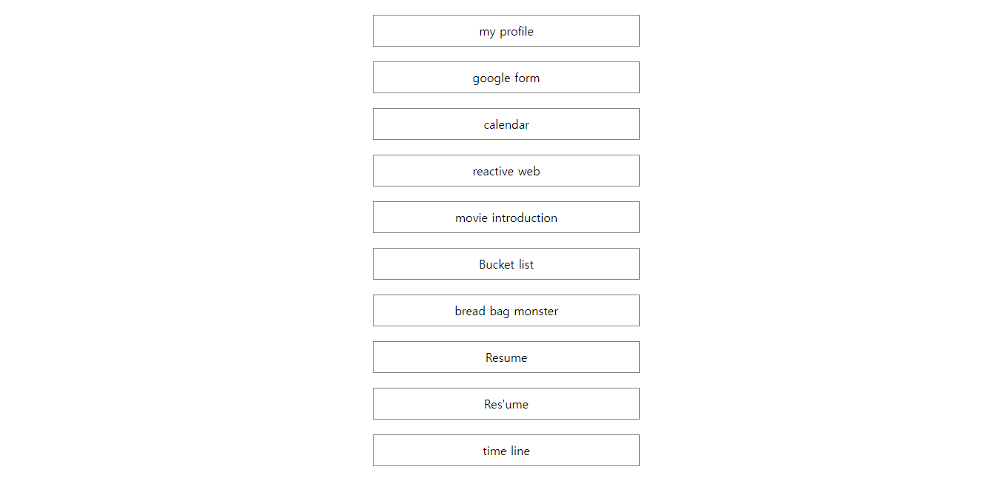</img>

2. 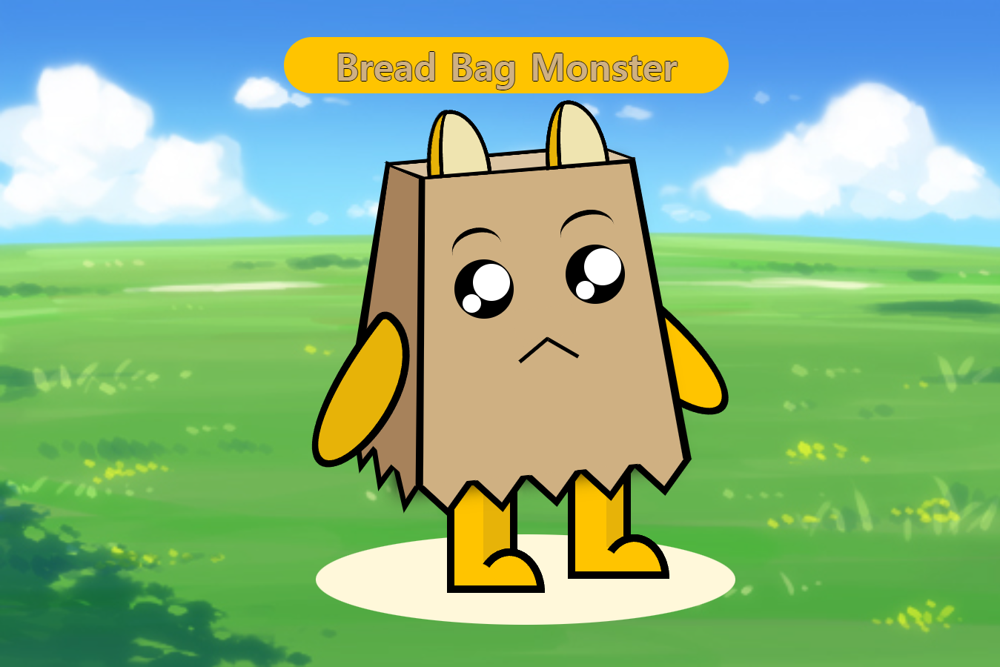</img>

3. 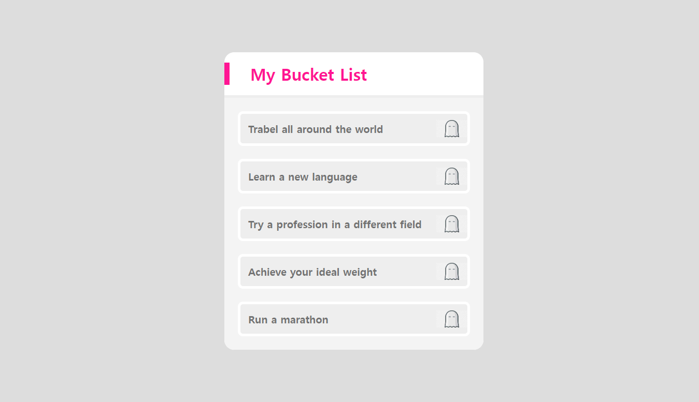</img>

4. 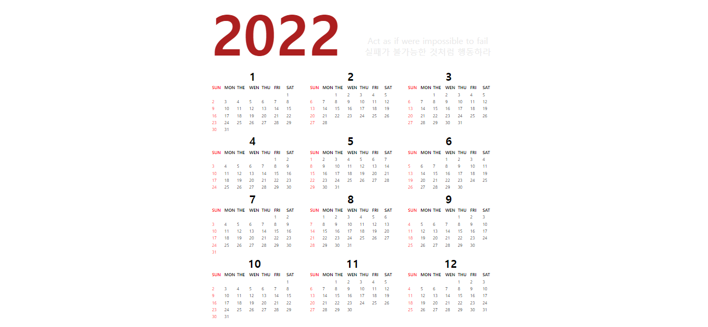</img>

5. 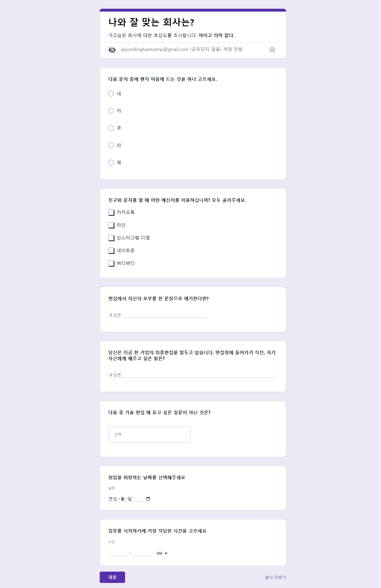</img>

6. 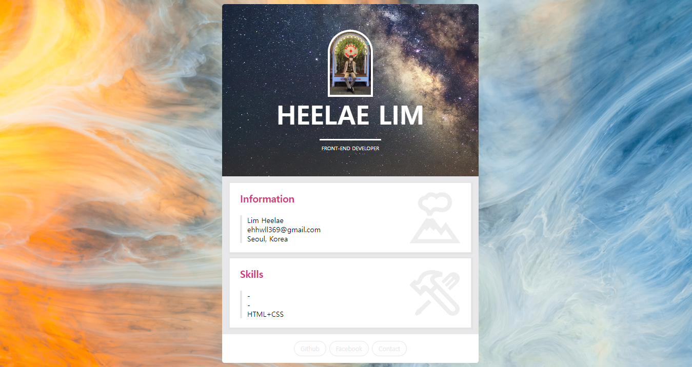</img>

7. 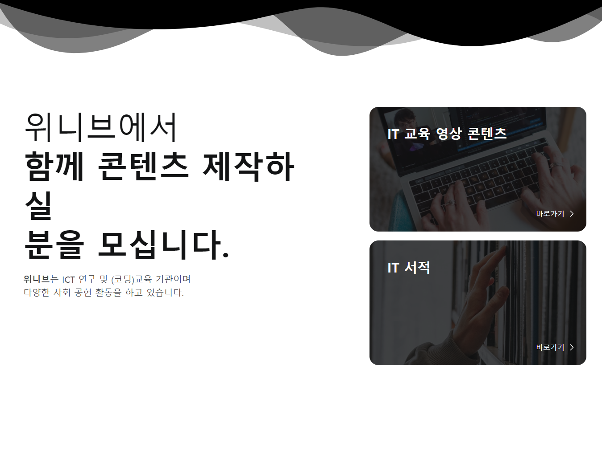</img>

8. 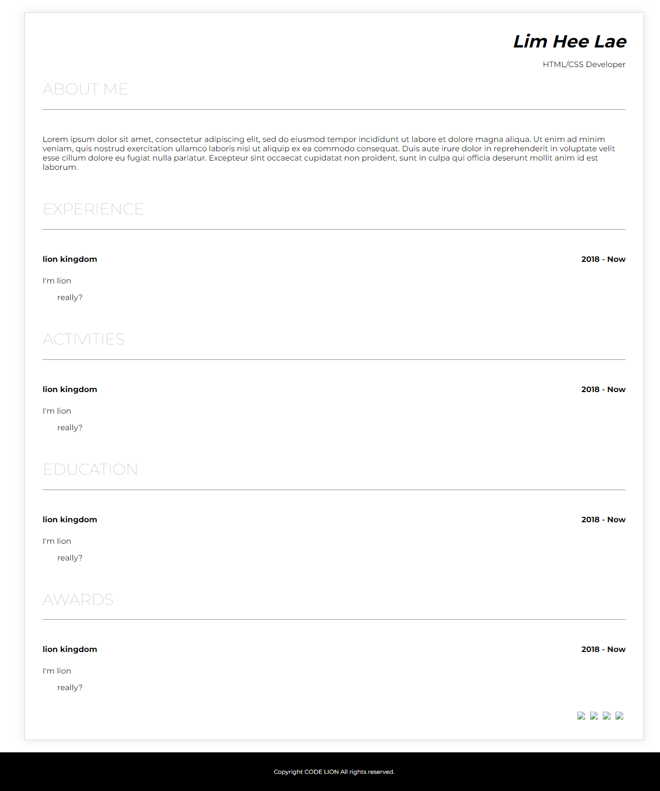</img>

9. 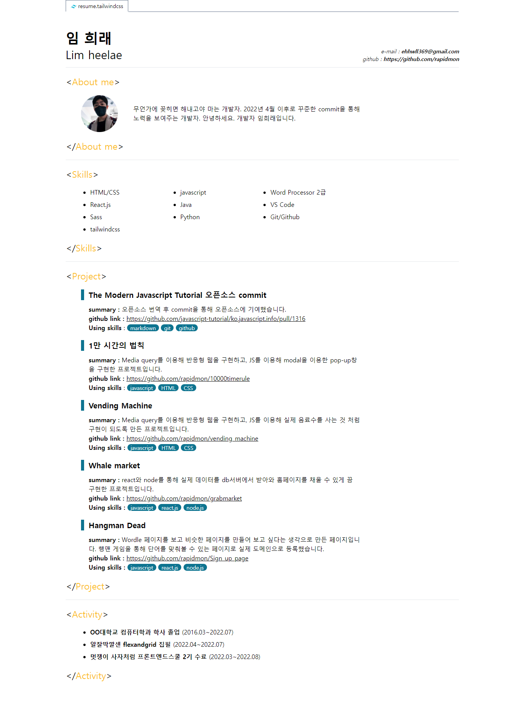</img>

## Repository Description

멋쟁이사자처럼 프론트엔드 스쿨 2기에서 주어진 과제들입니다.
1. 메인 페이지입니다.
2. css작업을 통해 만든 캐릭터입니다.
3. 버킷리스트입니다.
4. table태그를 이용해 만든 달력입니다.
5. input 요소들을 이용해 만든 구글 폼입니다.
6. 나의 프로필을 만들어 보았습니다.
7. 반응형 웹 페이지입니다.
8. 자소서입니다.
9. 제출용으로 만들어 본 이력서입니다.

## How to drive

1. 메인페이지를 통해 다른 페이지들로 이동할 수 있습니다.

2. 캐릭터에 손을 가져다 대면 캐릭터가 움직입니다.

    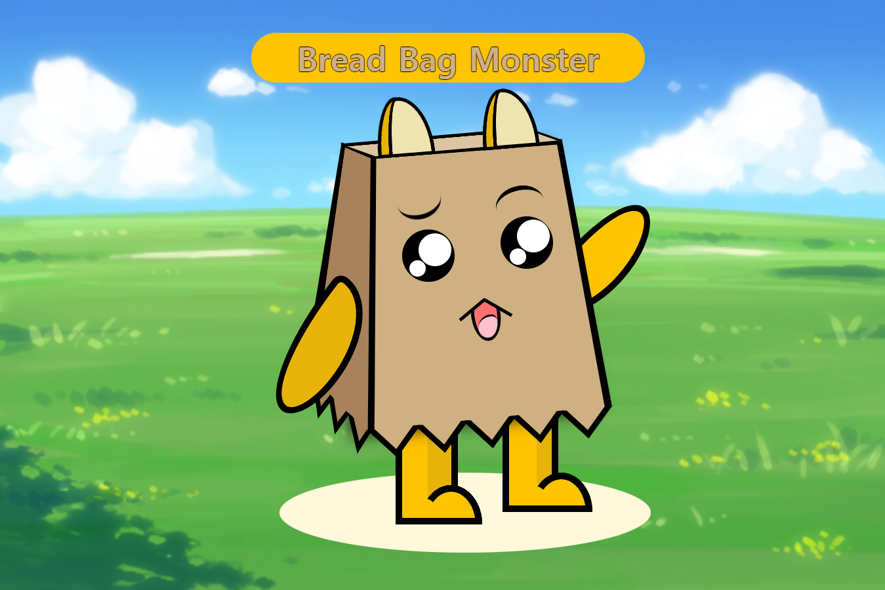</img>

3. 버킷리스트입니다. 각 항목에 마우스를 가져다 대면 유령이 눈을 뜹니다.

    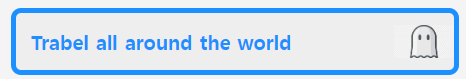</img>

7. 미디어 쿼리를 이용해 만든 반응형 웹입니다. 패드일 때와 모바일일때를 구분하여 설정했습니다.

    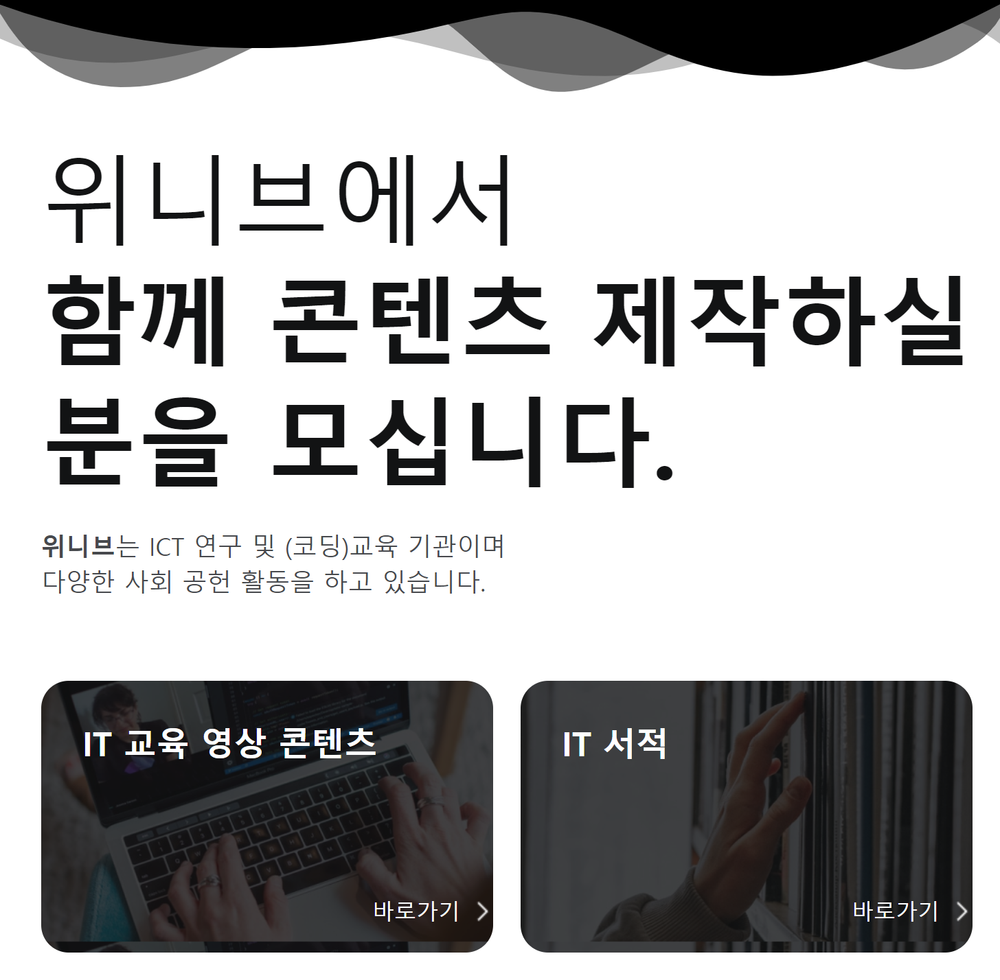</img>
    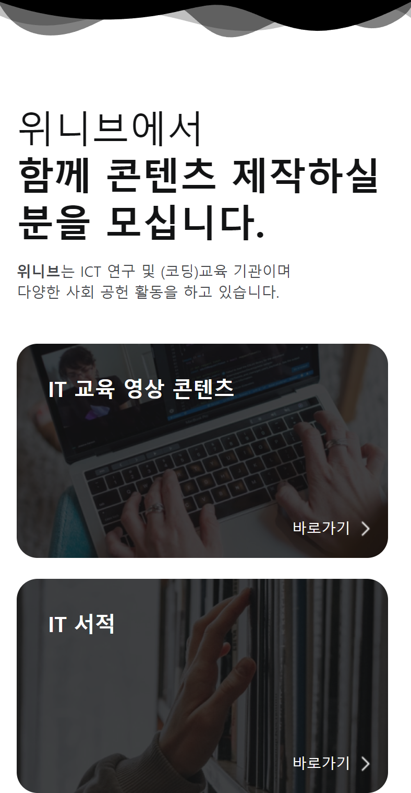</img>
